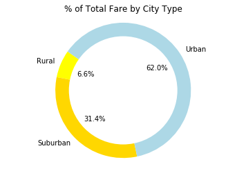
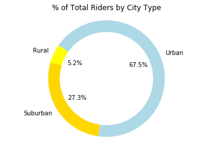

## Option 1: Pyber


The ride sharing bonanza continues! Seeing the success of notable players like Uber and Lyft, you've decided to join a fledgling ride sharing company of your own. In your latest capacity, you'll be acting as Chief Data Strategist for the company. In this role, you'll be expected to offer data-backed guidance on new opportunities for market differentiation.

You've since been given access to the company's complete recordset of rides. This contains information about every active driver and historic ride, including details like city, driver count, individual fares, and city type.

Your objective is to build a [Bubble Plot](https://en.wikipedia.org/wiki/Bubble_chart) that showcases the relationship between four key variables:

* Average Fare ($) Per City
* Total Number of Rides Per City
* Total Number of Drivers Per City
* City Type (Urban, Suburban, Rural)

In addition, you will be expected to produce the following three pie charts:

* % of Total Fares by City Type
* % of Total Rides by City Type
* % of Total Drivers by City Type

As final considerations:

* You must use the Pandas Library and the Jupyter Notebook.
* You must use the Matplotlib and Seaborn libraries.
* You must include a written description of three observable trends based on the data.
* You must use proper labeling of your plots, including aspects like: Plot Titles, Axes Labels, Legend Labels, Wedge Percentages, and Wedge Labels.
* Remember when making your plots to consider aesthetics!
  * You must stick to the Pyber color scheme (Gold, Light Sky Blue, and Light Coral) in producing your plot and pie charts.
  * When making your Bubble Plot, experiment with effects like `alpha`, `edgecolor`, and `linewidths`.
  * When making your Pie Chart, experiment with effects like `shadow`, `startangle`, and `explosion`.
* You must include an exported markdown version of your Notebook called  `README.md` in your GitHub repository.
* See [Example Solution](Pyber/Pyber_Example.pdf) for a reference on expected format.


```python
# Dependencies
import numpy as np
import pandas as pd
import matplotlib.pyplot as plt
```


```python
# Read data
city_data = pd.read_csv("raw_data/city_data.csv")
ride_data = pd.read_csv("raw_data/ride_data.csv")
```


```python
combined_data = city_data.merge(ride_data, left_on='city',right_on='city',how='outer')
drivers_per_city = combined_data.groupby(['city']).count().reset_index()
fare_per_city = combined_data.groupby(['city','type']).mean().reset_index()
ride_per_city = combined_data.groupby(['city','type']).nunique()
```


```python
chart_df = pd.DataFrame()
chart_df['x'] = ride_per_city['ride_id']
chart_df=chart_df.reset_index()

# Average Fare ($) Per City
chart_df['y'] = fare_per_city['fare']

# Total Number of Drivers Per City, Multiplyed by a constant to Improve the visual size in bubble chart
chart_df['s'] = drivers_per_city['driver_count']*10

# City Type (Urban, Suburban, Rural)
chart_df['hue'] = fare_per_city['type']

#Sperates Data to Plot for Each Subgroup of Urban, Rural, Suburban
urban_df = chart_df.set_index('hue').loc['Urban']
rural_df = chart_df.set_index('hue').loc['Rural']
suburban_df = chart_df.set_index('hue').loc['Suburban']

#Grabs Catagory Names for the Chart Legend
transfer_df = chart_df.groupby(['hue']).count().reset_index()
```


```python
#Plots Each Catagory in a Scatter Plot Bubble Chart
plt.scatter(urban_df['x'], urban_df['y'], urban_df['s'], c='YELLOW', alpha=0.75, linewidth=0.1, edgecolor='BLACK')
plt.scatter(rural_df['x'], rural_df['y'], rural_df['s'], c='GOLD', alpha=0.75, linewidth=0.1, edgecolor='BLACK')
plt.scatter(suburban_df['x'], suburban_df['y'], suburban_df['s'], c='LIGHTBLUE', alpha=0.75, 
            linewidth=0.1, edgecolor='BLACK')

#Adds Labels to Chart
plt.title("Pyber Ride Sharing Data (2016)")
plt.ylabel("Average Fare ($)")
plt.xlabel("Total Nubmer of Rides (Per City)")
plt.legend(transfer_df['hue'])

# Plot Chart
plt.plot()
```


    []


```python
# Collect Data Needed for Total Fare Pie Chart
total_fare_df = combined_data[['type','fare']].groupby(['type']).sum().reset_index()

# Defines Labels and Size of the Pie Chart
labels = total_fare_df['type']
sizes = total_fare_df['fare']
colors = ["YELLOW", "GOLD", "LIGHTBLUE"]

# Creates Pie Chart
plt.pie(sizes, labels=transfer_df['hue'], colors=colors,
        autopct="%1.1f%%", startangle=145)
plt.title("% of Total Fare by City Type")
plt.axis('equal')

# Draw circle Over Center of Chart
centre_circle = plt.Circle((0,0),0.80,fc='white')
fig = plt.gcf()
fig.gca().add_artist(centre_circle)

# Plot Chart
plt.plot()
```


    []





```python
# Collect Data Needed for Total Riders Pie Chart
total_riders_df = combined_data[['type','driver_count']].groupby(['type']).count().reset_index()

# Defines Labels and Size of the Pie Chart
labels = total_riders_df['type']
sizes = total_riders_df['driver_count']
colors = ["YELLOW", "GOLD", "LIGHTBLUE"]

# Creates Pie Chart
plt.pie(sizes, labels=transfer_df['hue'], colors=colors,
        autopct="%1.1f%%", startangle=145)
plt.title("% of Total Riders by City Type")
plt.axis('equal')

# Draw circle Over Center of Chart
centre_circle = plt.Circle((0,0),0.80,fc='white')
fig = plt.gcf()
fig.gca().add_artist(centre_circle)

# Plot Chart
plt.plot()
```


    []





```python
# Collect Data Needed for Total Riders Pie Chart
pie_df2 = combined_data.groupby(['type']).nunique()

# Defines Labels and Size of the Pie Chart
labels = pie_df2['type']
sizes = pie_df2['driver_count']
colors = ["YELLOW", "GOLD", "LIGHTBLUE"]

# Creates Pie Chart
plt.pie(sizes, labels=transfer_df['hue'], colors=colors,
        autopct="%1.1f%%", startangle=145)
plt.title("% of Total Drivers by City Type")
plt.axis('equal')

# Draw circle Over Center of Chart
centre_circle = plt.Circle((0,0),0.80,fc='white')
fig = plt.gcf()
fig.gca().add_artist(centre_circle)

# Plot Chart
plt.plot()
```


    []


