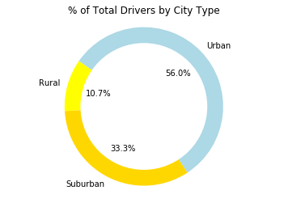

## Pyber
* Rural Clients pay the least.
* Most riders and drivers are from urban areas.
* Suburban areas have the wides spread of fares.


```python
# Dependencies
import numpy as np
import pandas as pd
import matplotlib.pyplot as plt
```


```python
# Read data
city_data = pd.read_csv("raw_data/city_data.csv")
ride_data = pd.read_csv("raw_data/ride_data.csv")
```


```python
# Formats Data for Use in Charts
combined_data = city_data.merge(ride_data, left_on='city',right_on='city',how='outer')
drivers_per_city = combined_data.groupby(['city']).count().reset_index()
fare_per_city = combined_data.groupby(['city','type']).mean().reset_index()
ride_per_city = combined_data.groupby(['city','type']).nunique()
```


```python
chart_df = pd.DataFrame()
chart_df['x'] = ride_per_city['ride_id']
chart_df=chart_df.reset_index()

# Average Fare ($) Per City
chart_df['y'] = fare_per_city['fare']

# Total Number of Drivers Per City, Multiplyed by a constant to Improve the visual size in bubble chart
chart_df['s'] = drivers_per_city['driver_count']*10

# City Type (Urban, Suburban, Rural)
chart_df['hue'] = fare_per_city['type']

#Sperates Data to Plot for Each Subgroup of Urban, Rural, Suburban
urban_df = chart_df.set_index('hue').loc['Urban']
rural_df = chart_df.set_index('hue').loc['Rural']
suburban_df = chart_df.set_index('hue').loc['Suburban']

#Grabs Catagory Names for the Chart Legend
transfer_df = chart_df.groupby(['hue']).count().reset_index()
```


```python
#Plots Each Catagory in a Scatter Plot Bubble Chart
plt.scatter(urban_df['x'], urban_df['y'], urban_df['s'], c='YELLOW', alpha=0.75, linewidth=0.1, edgecolor='BLACK')
plt.scatter(rural_df['x'], rural_df['y'], rural_df['s'], c='GOLD', alpha=0.75, linewidth=0.1, edgecolor='BLACK')
plt.scatter(suburban_df['x'], suburban_df['y'], suburban_df['s'], c='LIGHTBLUE', alpha=0.75, 
            linewidth=0.1, edgecolor='BLACK')

#Adds Labels to Chart
plt.title("Pyber Ride Sharing Data (2016)")
plt.ylabel("Average Fare ($)")
plt.xlabel("Total Nubmer of Rides (Per City)")
plt.legend(transfer_df['hue'])

# Plot Chart
plt.plot()
```


    []


```python
# Collect Data Needed for Total Fare Pie Chart
total_fare_df = combined_data[['type','fare']].groupby(['type']).sum().reset_index()

# Defines Labels and Size of the Pie Chart
labels = total_fare_df['type']
sizes = total_fare_df['fare']
colors = ["YELLOW", "GOLD", "LIGHTBLUE"]

# Creates Pie Chart
plt.pie(sizes, labels=transfer_df['hue'], colors=colors,
        autopct="%1.1f%%", startangle=145)
plt.title("% of Total Fare by City Type")
plt.axis('equal')

# Draw circle Over Center of Chart
centre_circle = plt.Circle((0,0),0.80,fc='white')
fig = plt.gcf()
fig.gca().add_artist(centre_circle)

# Plot Chart
plt.plot()
```


    []


```python
# Collect Data Needed for Total Riders Pie Chart
total_riders_df = combined_data[['type','driver_count']].groupby(['type']).count().reset_index()

# Defines Labels and Size of the Pie Chart
labels = total_riders_df['type']
sizes = total_riders_df['driver_count']
colors = ["YELLOW", "GOLD", "LIGHTBLUE"]

# Creates Pie Chart
plt.pie(sizes, labels=transfer_df['hue'], colors=colors,
        autopct="%1.1f%%", startangle=145)
plt.title("% of Total Riders by City Type")
plt.axis('equal')

# Draw circle Over Center of Chart
centre_circle = plt.Circle((0,0),0.80,fc='white')
fig = plt.gcf()
fig.gca().add_artist(centre_circle)

# Plot Chart
plt.plot()
```


    []


```python
# Collect Data Needed for Total Riders Pie Chart
pie_df2 = combined_data.groupby(['type']).nunique()

# Defines Labels and Size of the Pie Chart
labels = pie_df2['type']
sizes = pie_df2['driver_count']
colors = ["YELLOW", "GOLD", "LIGHTBLUE"]

# Creates Pie Chart
plt.pie(sizes, labels=transfer_df['hue'], colors=colors,
        autopct="%1.1f%%", startangle=145)
plt.title("% of Total Drivers by City Type")
plt.axis('equal')

# Draw circle Over Center of Chart
centre_circle = plt.Circle((0,0),0.80,fc='white')
fig = plt.gcf()
fig.gca().add_artist(centre_circle)

# Plot Chart
plt.plot()
```


    []




